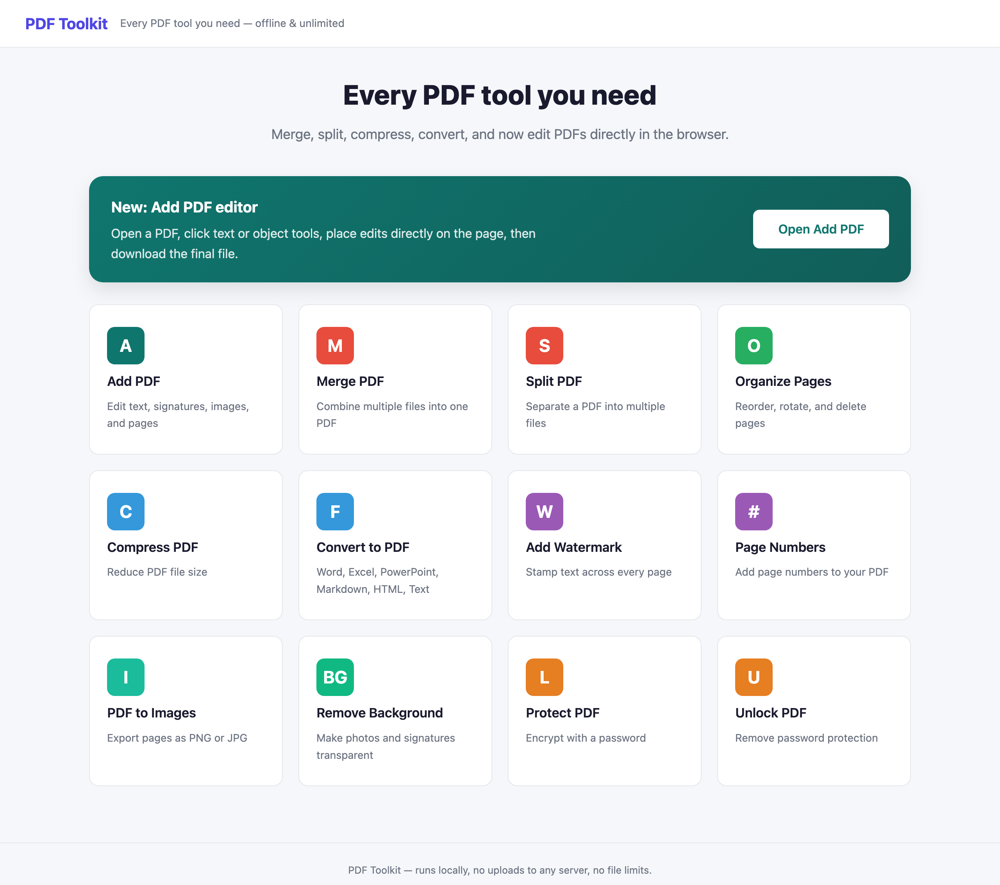

# PDF Toolkit

A private, **offline** PDF toolkit that runs in your browser. Merge, split, organize, compress, convert, watermark, sign, and clean up PDFs — all processed **locally on your own machine**. Your files are never uploaded to any server.

> No subscriptions. No cloud uploads. No tracking. Just open it and work.

---

## Why this exists

Most online PDF tools make you upload sensitive documents to a stranger's server. For anyone handling private paperwork — legal files, IDs, contracts, financial records — that's a non-starter. **PDF Toolkit** gives you the same convenience as those websites, but everything stays on your computer.

## Features

| Tool | What it does |
|------|--------------|
| **Add PDF (Editor)** | Edit text, add signatures & images, and rearrange pages |
| **Merge PDF** | Combine multiple files into one PDF |
| **Split PDF** | Separate a PDF into multiple files |
| **Organize Pages** | Reorder, rotate, and delete pages |
| **Compress PDF** | Reduce file size |
| **Convert to PDF** | Word, Excel, PowerPoint, Markdown, HTML, and text → PDF |
| **Add Watermark** | Stamp text across every page |
| **Page Numbers** | Insert page numbers |
| **PDF to Images** | Export pages as PNG or JPG |
| **Remove Background** | Make photos and signatures transparent |
| **Protect PDF** | Encrypt with a password |
| **Unlock PDF** | Remove password protection |

## Screenshot



## Tech stack

- **Backend:** Python + [Flask](https://flask.palletsprojects.com/)
- **PDF engine:** [pypdf](https://pypdf.readthedocs.io/), [PyMuPDF](https://pymupdf.readthedocs.io/), [pypdfium2](https://github.com/pypdfium2-team/pypdfium2), [reportlab](https://www.reportlab.com/), [fpdf2](https://py-pdf.github.io/fpdf2/)
- **Images:** [Pillow](https://python-pillow.org/), [rembg](https://github.com/danielgatis/rembg) (background removal)
- **Office conversion:** python-docx, python-pptx, openpyxl, markdown, bleach
- **Frontend:** Server-rendered HTML templates + vanilla JS

## Requirements

- Python **3.10 or newer**
- macOS, Windows, or Linux

## Installation

```bash
# 1. Clone the repository
git clone https://github.com/<your-username>/pdf-toolkit.git
cd pdf-toolkit

# 2. Create and activate a virtual environment
python3 -m venv .venv
source .venv/bin/activate        # On Windows: .venv\Scripts\activate

# 3. Install dependencies
pip install -r requirements.txt
```

## Running the app

```bash
python app.py
```

Then open **http://127.0.0.1:5001** in your browser (it opens automatically).

**macOS shortcut:** double-click `RUN_APP.command` to launch without using the terminal.

## Project structure

```
.
├── app.py                 # Entry point — starts the local web server
├── requirements.txt       # Python dependencies
├── RUN_APP.command        # One-click launcher for macOS
├── toolkit/
│   ├── __init__.py        # Flask app factory + tool registry
│   ├── config.py          # Paths and constants
│   ├── routes/            # One module per tool (merge, split, …)
│   ├── services/          # The actual PDF/image processing logic
│   └── utils/             # Shared helpers
├── templates/             # HTML pages (index, tool, editor)
└── static/                # CSS, JS, and libraries
```

## Contributing

Contributions, bug reports, and feature ideas are welcome. Open an issue or a pull request.

## License

Released under the [MIT License](LICENSE).
